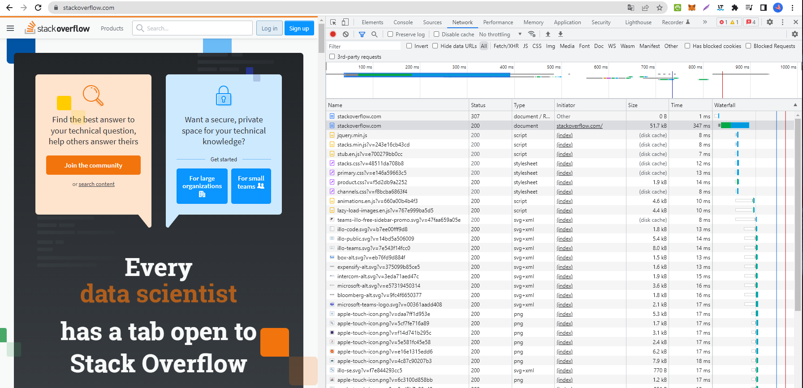

# Домашнее задание к занятию "3.6. Компьютерные сети, лекция 1"

1. Работа c HTTP через телнет.
-[x] Подключитесь утилитой телнет к сайту stackoverflow.com telnet stackoverflow.com 80
-[x] Отправьте HTTP запрос
-[x] В ответе укажите полученный HTTP код, что он означает?

```
GET /questions HTTP/1.0
HOST: stackoverflow.com
[press enter]
[press enter]
```
*Ответ:*

```
vagrant@vagrant:~$ telnet stackoverflow.com 80
Trying 151.101.129.69...
Connected to stackoverflow.com.
Escape character is '^]'.
GET /questions HTTP/1.0
HOST: stackoverflow.com

HTTP/1.1 301 Moved Permanently
cache-control: no-cache, no-store, must-revalidate
location: https://stackoverflow.com/questions
x-request-guid: 8ec96ec9-5c54-4468-80e1-ddec9e9624ea
feature-policy: microphone 'none'; speaker 'none'
content-security-policy: upgrade-insecure-requests; frame-ancestors 'self' https://stackexchange.com
Accept-Ranges: bytes
Date: Mon, 11 Apr 2022 18:06:49 GMT
Via: 1.1 varnish
Connection: close
X-Served-By: cache-vie6368-VIE
X-Cache: MISS
X-Cache-Hits: 0
X-Timer: S1649700410.632321,VS0,VE102
Vary: Fastly-SSL
X-DNS-Prefetch-Control: off
Set-Cookie: prov=b0af163e-5cba-1a94-1b4f-5a6573b7e949; domain=.stackoverflow.com; expires=Fri, 01-Jan-2055 00:00:00 GMT; path=/; HttpOnly

Connection closed by foreign host.
```
 Ресурс перемещен на https://stackoverflow.com/questions


2. Повторите задание 1 в браузере, используя консоль разработчика F12.
- [x] откройте вкладку Network
- [x] отправьте запрос http://stackoverflow.com
- [x] найдите первый ответ HTTP сервера, откройте вкладку Headers 
- [x] укажите в ответе полученный HTTP код. 
```
Request URL: http://stackoverflow.com/
Request Method: GET
Status Code: 307 Internal Redirect
Referrer Policy: strict-origin-when-cross-origin
Cross-Origin-Resource-Policy: Cross-Origin
Location: https://stackoverflow.com/
Non-Authoritative-Reason: HSTS
Accept: text/html,application/xhtml+xml,application/xml;q=0.9,image/avif,image/webp,image/apng,*/*;q=0.8,application/signed-exchange;v=b3;q=0.9
Upgrade-Insecure-Requests: 1
User-Agent: Mozilla/5.0 (Windows NT 10.0; Win64; x64) AppleWebKit/537.36 (KHTML, like Gecko) Chrome/100.0.4896.60 Safari/537.36
```
- [x] проверьте время загрузки страницы, какой запрос обрабатывался дольше всего? 
Этот запрос обрабатывается дольше всего - 347 ms
```
Request URL: https://stackoverflow.com/
Request Method: GET
Status Code: 200 
Remote Address: 151.101.193.69:443
Referrer Policy: strict-origin-when-cross-origin

```

- [x] приложите скриншот консоли браузера в ответ.




3.
- [x] Какой IP адрес у вас в интернете?

*Ответ:*
 IP адрес можно узнать с помощью специального сайта например - https://whatismyipaddress.com/
Linux - можно воспользовататься командой ```curl ident.me```
но выкладывать не буду (:

4.
- [x] Какому провайдеру принадлежит ваш IP адрес?
  
    Net Global srl
- [x] Какой автономной системе AS?

  AS50316
- [x] Воспользуйтесь утилитой whois
 
*Ответ:*

Установим утилиту whois

```
vagrant@vagrant:~$ sudo apt install whois
Reading package lists... Done
Building dependency tree
Reading state information... Done
The following NEW packages will be installed:
  whois
0 upgraded, 1 newly installed, 0 to remove and 0 not upgraded.
Need to get 44.7 kB of archives.
After this operation, 279 kB of additional disk space will be used.
Get:1 http://us.archive.ubuntu.com/ubuntu focal/main amd64 whois amd64 5.5.6 [44.7 kB]
Fetched 44.7 kB in 0s (100 kB/s)
Selecting previously unselected package whois.
(Reading database ... 40620 files and directories currently installed.)
Preparing to unpack .../archives/whois_5.5.6_amd64.deb ...
Unpacking whois (5.5.6) ...
Setting up whois (5.5.6) ...
Processing triggers for man-db (2.9.1-1) ...

```

Воспользуемся любым IP адресом например 192.158.1.38
```
vagrant@vagrant:~$ whois 185.96.98.53

% This is the RIPE Database query service.
% The objects are in RPSL format.
%
% The RIPE Database is subject to Terms and Conditions.
% See http://www.ripe.net/db/support/db-terms-conditions.pdf

% Note: this output has been filtered.
%       To receive output for a database update, use the "-B" flag.

% Information related to '185.96.98.0 - 185.96.98.255'

% Abuse contact for '185.96.98.0 - 185.96.98.255' is 'abuse@wifi4all.it'

inetnum:        185.96.98.0 - 185.96.98.255
netname:        NETGLOBAL_END_USERS
country:        IT
admin-c:        SM12216-RIPE
tech-c:         BA4190-RIPE
status:         ASSIGNED PA
mnt-by:         MNT-NETGLOBAL
created:        2015-07-06T16:05:24Z
last-modified:  2018-06-27T13:16:31Z
source:         RIPE

person:         Bondesan Alessandro
address:        Net Global srl
address:        Via Veneto, 34/38
address:        35020 Due Carrare (PD)
address:        Italy
phone:          +390495290561
nic-hdl:        BA4190-RIPE
mnt-by:         MNT-NETGLOBAL
created:        2012-01-27T15:28:32Z
last-modified:  2020-04-24T07:06:03Z
source:         RIPE

person:         Spiller Marco
address:        Net Global srl
address:        Via Veneto, 34/38
address:        35020 Due Carrare (PD)
address:        Italy
phone:          +390495290561
fax-no:         +390499115784
nic-hdl:        SM12216-RIPE
mnt-by:         MNT-NETGLOBAL
created:        2009-11-03T17:53:13Z
last-modified:  2016-05-16T09:47:03Z
source:         RIPE

% Information related to '185.96.98.0/24AS50316'

route:          185.96.98.0/24
descr:          Net Global srl
origin:         AS50316
mnt-by:         MNT-NETGLOBAL
created:        2019-12-02T16:58:38Z
last-modified:  2020-12-11T14:05:07Z
source:         RIPE

% This query was served by the RIPE Database Query Service version 1.102.3 (BLAARKOP)

```
5.
- [ ] Через какие сети проходит пакет, отправленный с вашего компьютера на адрес 8.8.8.8?
- [ ] Через какие AS?
- [x] Воспользуйтесь утилитой traceroute
*Ответ:*
Установим утилиту traceroute

```
vagrant@vagrant:~$ sudo apt install traceroute
Reading package lists... Done
Building dependency tree
Reading state information... Done
The following NEW packages will be installed:
  traceroute
0 upgraded, 1 newly installed, 0 to remove and 0 not upgraded.
Need to get 45.4 kB of archives.
After this operation, 152 kB of additional disk space will be used.
Get:1 http://us.archive.ubuntu.com/ubuntu focal/universe amd64 traceroute amd64 1:2.1.0-2 [45.4 kB]
Fetched 45.4 kB in 0s (102 kB/s)
Selecting previously unselected package traceroute.
(Reading database ... 40629 files and directories currently installed.)
Preparing to unpack .../traceroute_1%3a2.1.0-2_amd64.deb ...
Unpacking traceroute (1:2.1.0-2) ...
Setting up traceroute (1:2.1.0-2) ...
update-alternatives: using /usr/bin/traceroute.db to provide /usr/bin/traceroute (traceroute) in auto mode
update-alternatives: using /usr/bin/lft.db to provide /usr/bin/lft (lft) in auto mode
update-alternatives: using /usr/bin/traceproto.db to provide /usr/bin/traceproto (traceproto) in auto mode
update-alternatives: using /usr/sbin/tcptraceroute.db to provide /usr/sbin/tcptraceroute (tcptraceroute) in auto mode
Processing triggers for man-db (2.9.1-1) ...
```
```
vagrant@vagrant:~$ traceroute -An 8.8.8.8
traceroute to 8.8.8.8 (8.8.8.8), 30 hops max, 60 byte packets
1  10.0.2.2 [*]  2.357 ms  2.271 ms  2.213 ms
2  * * *
3  * * *
4  * * *
5  * * *
6  * * *
7  * * *
8  * * *
9  * * *
10  * * *
11  * * *
12  * * *
13  * * *
14  * * *
15  * * *
16  * * *
17  * * *
18  * * *
19  * * *
20  * * *
21  * * *
22  * * *
23  * * *
24  * * *
25  * * *
26  * * *
27  * * *
28  * * *
29  * * *
30  * * *
``` 
6. - [ ] Повторите задание 5 в утилите mtr. На каком участке наибольшая задержка - delay?

*Ответ:*
Установим:

```sudo apt install mtr```

7. - [x] Какие DNS сервера отвечают за доменное имя dns.google? Какие A записи? воспользуйтесь утилитой dig
*Ответ:*

Установим:

```sudo apt install dnsutils```
```
vagrant@vagrant:~$ dig dns.google +noall +answer
dns.google.             702     IN      A       8.8.8.8
dns.google.             702     IN      A       8.8.4.4
```

8. - [x] Проверьте PTR записи для IP адресов из задания 7. Какое доменное имя привязано к IP? воспользуйтесь утилитой dig
   В качестве ответов на вопросы можно приложите лог выполнения команд в консоли или скриншот полученных результатов.

*Ответ:*


```

vagrant@vagrant:~$ dig -x 8.8.8.8

; <<>> DiG 9.16.1-Ubuntu <<>> -x 8.8.8.8
;; global options: +cmd
;; Got answer:
;; ->>HEADER<<- opcode: QUERY, status: NOERROR, id: 2346
;; flags: qr rd ra; QUERY: 1, ANSWER: 1, AUTHORITY: 0, ADDITIONAL: 1

;; OPT PSEUDOSECTION:
; EDNS: version: 0, flags:; udp: 65494
;; QUESTION SECTION:
;8.8.8.8.in-addr.arpa.          IN      PTR

;; ANSWER SECTION:
8.8.8.8.in-addr.arpa.   54004   IN      PTR     dns.google.

;; Query time: 3 msec
;; SERVER: 127.0.0.53#53(127.0.0.53)
;; WHEN: Mon Apr 11 17:59:32 UTC 2022
;; MSG SIZE  rcvd: 73

vagrant@vagrant:~$ dig -x 8.8.4.4

; <<>> DiG 9.16.1-Ubuntu <<>> -x 8.8.4.4
;; global options: +cmd
;; Got answer:
;; ->>HEADER<<- opcode: QUERY, status: NOERROR, id: 62088
;; flags: qr rd ra; QUERY: 1, ANSWER: 1, AUTHORITY: 0, ADDITIONAL: 1

;; OPT PSEUDOSECTION:
; EDNS: version: 0, flags:; udp: 65494
;; QUESTION SECTION:
;4.4.8.8.in-addr.arpa.          IN      PTR

;; ANSWER SECTION:
4.4.8.8.in-addr.arpa.   7912    IN      PTR     dns.google.

;; Query time: 3 msec
;; SERVER: 127.0.0.53#53(127.0.0.53)
;; WHEN: Mon Apr 11 18:00:12 UTC 2022
;; MSG SIZE  rcvd: 73

