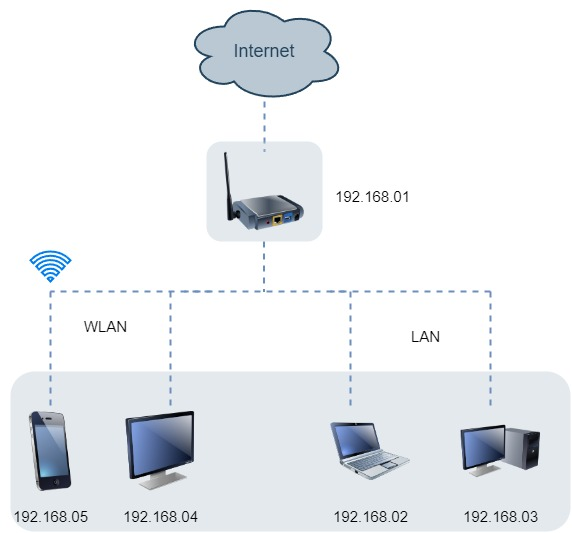

# Домашнее задание к занятию "3.8. Компьютерные сети, лекция 3"

## 1. Подключитесь к публичному маршрутизатору в интернет. Найдите маршрут к вашему публичному IP

```
telnet route-views.routeviews.org
Username: rviews
show ip route x.x.x.x/32
show bgp x.x.x.x/32

route-views>show ip route 185.63.99.53
Routing entry for 185.63.96.0/22
  Known via "bgp 6447", distance 20, metric 0
  Tag 6939, type external
  Last update from 64.71.137.241 4w3d ago
  Routing Descriptor Blocks:
  * 64.71.137.241, from 64.71.137.241, 4w3d ago
      Route metric is 0, traffic share count is 1
      AS Hops 3
      Route tag 6939
      MPLS label: none
 
```
## 2. Создайте dummy0 интерфейс в Ubuntu. Добавьте несколько статических маршрутов. Проверьте таблицу маршрутизации.

```
https://ixnfo.com/sozdanie-dummy-interfeysov-v-linux.html

vagrant@vagrant:~$ sudo modprobe -v dummy
insmod /lib/modules/5.4.0-91-generic/kernel/drivers/net/dummy.ko numdummies=0
vagrant@vagrant:~$ lsmod | grep dummy
dummy                  16384  0

vagrant@vagrant:~$ sudo ip link add dummy0 type dummy
vagrant@vagrant:~$ ip a
1: lo: <LOOPBACK,UP,LOWER_UP> mtu 65536 qdisc noqueue state UNKNOWN group default qlen 1000
    link/loopback 00:00:00:00:00:00 brd 00:00:00:00:00:00
    inet 127.0.0.1/8 scope host lo
       valid_lft forever preferred_lft forever
    inet6 ::1/128 scope host
       valid_lft forever preferred_lft forever
2: eth0: <BROADCAST,MULTICAST,UP,LOWER_UP> mtu 1500 qdisc fq_codel state UP group default qlen 1000
    link/ether 08:00:27:b1:28:5d brd ff:ff:ff:ff:ff:ff
    inet 10.0.2.15/24 brd 10.0.2.255 scope global dynamic eth0
       valid_lft 86240sec preferred_lft 86240sec
    inet6 fe80::a00:27ff:feb1:285d/64 scope link
       valid_lft forever preferred_lft forever
3: dummy0: <BROADCAST,NOARP> mtu 1500 qdisc noop state DOWN group default qlen 1000
    link/ether ea:aa:96:81:8c:32 brd ff:ff:ff:ff:ff:ff
    
vagrant@vagrant:~$ sudo ip addr add 192.168.1.150/24 dev dummy0
vagrant@vagrant:~$ sudo ip link set up dummy0
vagrant@vagrant:~$ ip a
1: lo: <LOOPBACK,UP,LOWER_UP> mtu 65536 qdisc noqueue state UNKNOWN group default qlen 1000
    link/loopback 00:00:00:00:00:00 brd 00:00:00:00:00:00
    inet 127.0.0.1/8 scope host lo
       valid_lft forever preferred_lft forever
    inet6 ::1/128 scope host
       valid_lft forever preferred_lft forever
2: eth0: <BROADCAST,MULTICAST,UP,LOWER_UP> mtu 1500 qdisc fq_codel state UP group default qlen 1000
    link/ether 08:00:27:b1:28:5d brd ff:ff:ff:ff:ff:ff
    inet 10.0.2.15/24 brd 10.0.2.255 scope global dynamic eth0
       valid_lft 86093sec preferred_lft 86093sec
    inet6 fe80::a00:27ff:feb1:285d/64 scope link
       valid_lft forever preferred_lft forever
3: dummy0: <BROADCAST,NOARP,UP,LOWER_UP> mtu 1500 qdisc noqueue state UNKNOWN group default qlen 1000
    link/ether ea:aa:96:81:8c:32 brd ff:ff:ff:ff:ff:ff
    inet 192.168.1.150/24 scope global dummy0
       valid_lft forever preferred_lft forever
    inet6 fe80::e8aa:96ff:fe81:8c32/64 scope link
       valid_lft forever preferred_lft forever
       
vagrant@vagrant:~$  ip route show
default via 10.0.2.2 dev eth0 proto dhcp src 10.0.2.15 metric 100
10.0.2.0/24 dev eth0 proto kernel scope link src 10.0.2.15
10.0.2.2 dev eth0 proto dhcp scope link src 10.0.2.15 metric 100
192.168.1.0/24 dev dummy0 proto kernel scope link src 192.168.1.150

vagrant@vagrant:~$ sudo ip route add 192.168.0.0/24 via 10.0.2.15
vagrant@vagrant:~$ sudo ip route add 188.243.0.0/16 via 192.168.1.150
vagrant@vagrant:~$ ip route show
default via 10.0.2.2 dev eth0 proto dhcp src 10.0.2.15 metric 100
10.0.2.0/24 dev eth0 proto kernel scope link src 10.0.2.15
10.0.2.2 dev eth0 proto dhcp scope link src 10.0.2.15 metric 100
188.243.0.0/16 via 192.168.1.150 dev dummy0
192.168.0.0/24 via 10.0.2.15 dev eth0
192.168.1.0/24 dev dummy0 proto kernel scope link src 192.168.1.150
```
## 3. Проверьте открытые TCP порты в Ubuntu, какие протоколы и приложения используют эти порты? Приведите несколько примеров.
```
vagrant@vagrant:~$ sudo apt install net-tools
vagrant@vagrant:~$ sudo netstat -plnut
Active Internet connections (only servers)
Proto Recv-Q Send-Q Local Address           Foreign Address         State       PID/Program name
tcp        0      0 127.0.0.53:53           0.0.0.0:*               LISTEN      908/systemd-resolve
tcp        0      0 0.0.0.0:22              0.0.0.0:*               LISTEN      994/sshd: /usr/sbin
tcp6       0      0 :::80                   :::*                    LISTEN      1030/apache2
tcp6       0      0 :::22                   :::*                    LISTEN      994/sshd: /usr/sbin
tcp6       0      0 :::443                  :::*                    LISTEN      1030/apache2
udp        0      0 127.0.0.53:53           0.0.0.0:*                           908/systemd-resolve
udp        0      0 10.0.2.15:68            0.0.0.0:*                           906/systemd-network

```

## 4. Проверьте используемые UDP сокеты в Ubuntu, какие протоколы и приложения используют эти порты?
```
vagrant@vagrant:~$ sudo netstat -pnlu
Active Internet connections (only servers)
Proto Recv-Q Send-Q Local Address           Foreign Address         State       PID/Program name
udp        0      0 127.0.0.53:53           0.0.0.0:*                           908/systemd-resolve
udp        0      0 10.0.2.15:68            0.0.0.0:*                           906/systemd-network

p - Отображает идентификатор процесса, связанный с именем службы или программы.
n – Отображает числовой номер работающего порта, например 3306 за mysqldа также 22 за sshd.
l — Показывает прослушивающие сокеты
u — Отображает UDP-соединения

```
## 5. Используя diagrams.net, создайте L3 диаграмму вашей домашней сети или любой другой сети, с которой вы работали.
