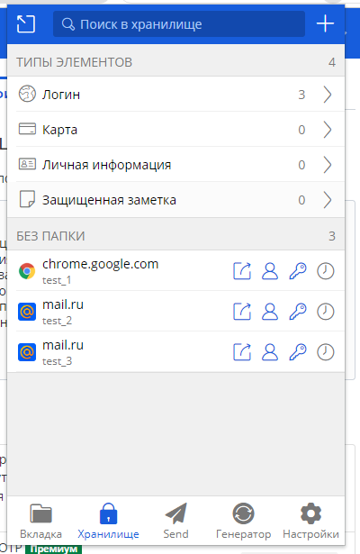
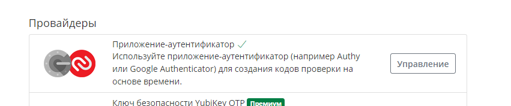

# Домашнее задание к занятию "3.9. Элементы безопасности информационных систем"

## Задача 1
- [x] Установите Bitwarden плагин для браузера
- [x] Зарегестрируйтесь
- [x] Сохраните несколько паролей


## Задача 2
- [x] Установите Google authenticator на мобильный телефон.
- [x] Настройте вход в Bitwarden акаунт через Google authenticator OTP.



## Задача 3
- [x] Установите apache2
```
vagrant@vagrant:~$ sudo apt install apache2
E: Aborting install.
vagrant@vagrant:~$ sudo apt update
vagrant@vagrant:~$ sudo apt install apache2
...
Reading package lists... Done
Enabling module dir.
Enabling module autoindex.
Enabling module env.
Enabling module mime.
Enabling module negotiation.
...
vagrant@vagrant:~$ sudo a2enmod ssl
Considering dependency setenvif for ssl:
Module setenvif already enabled
Considering dependency mime for ssl:
Module mime already enabled
Considering dependency socache_shmcb for ssl:
Enabling module socache_shmcb.
Enabling module ssl.
See /usr/share/doc/apache2/README.Debian.gz on how to configure SSL and create self-signed certificates.
To activate the new configuration, you need to run:
  systemctl restart apache2
vagrant@vagrant:~$ sudo service apache2 restart 

# Создание новой директории
vagrant@vagrant:~$ sudo mkdir /etc/apache2/ssl
```
- [x] Cгенерируйте самоподписанный сертификат
- [ ] Настройте тестовый сайт для работы по HTTPS.
```
vagrant@vagrant:~$ sudo a2enmod ssl
Considering dependency setenvif for ssl:
Module setenvif already enabled
Considering dependency mime for ssl:
Module mime already enabled
Considering dependency socache_shmcb for ssl:
Module socache_shmcb already enabled
Module ssl already enabled
vagrant@vagrant:~$ sudo systemctl restart apache2
vagrant@vagrant:~$ sudo openssl req -x509 -nodes -days 90 -newkey rsa:2048 -keyout /etc/ssl/private/selfsigned.key -out /etc/ssl/certs/selfsigned.crt
Generating a RSA private key
...........................................................+++++
........+++++
writing new private key to '/etc/ssl/private/apache-selfsigned.key'
-----
You are about to be asked to enter information that will be incorporated
into your certificate request.
What you are about to enter is what is called a Distinguished Name or a DN.
There are quite a few fields but you can leave some blank
For some fields there will be a default value,
If you enter '.', the field will be left blank.
-----
Country Name (2 letter code) [AU]:RU
State or Province Name (full name) [Some-State]:SURGUT
Locality Name (eg, city) []:SURGUT
Organization Name (eg, company) [Internet Widgits Pty Ltd]:HOME
Organizational Unit Name (eg, section) []:HOME
Common Name (e.g. server FQDN or YOUR name) []: testsite.com
Email Address []:test@test.com

vagrant@vagrant:~$ sudo nano /etc/apache2/sites-available/10.0.2.2.conf
vagrant@vagrant:~$ sudo mkdir /var/www/10.0.2.2
vagrant@vagrant:~$ udo nano /var/www/10.0.2.2/index.html
-bash: udo: command not found
vagrant@vagrant:~$ sudo nano /var/www/10.0.2.2/index.html
vagrant@vagrant:~$ sudo a2ensite 10.0.2.2.conf
Enabling site 10.0.2.2.
To activate the new configuration, you need to run:
  systemctl reload apache2
vagrant@vagrant:~$ sudo systemctl reload apache2
vagrant@vagrant:~$ sudo a2ensite 10.0.2.2.conf
Site 10.0.2.2 already enabled

vagrant@vagrant:~$ sudo ls /etc/ssl/certs | grep self
selfsigned.crt
vagrant@vagrant:~$ sudo ls /etc/ssl/private/ | grep self
selfsigned.key
vagrant@vagrant:~$ sudo vim /etc/apache2/sites-available/testsite.com.conf

<VirtualHost *:443>
ServerName testsite.com
DocumentRoot /var/www/testsite
SSLEngine on
SSLCertificateFile /etc/ssl/certs/selfsigned.crt
SSLCertificateKeyFile /etc/ssl/private/selfsigned.key
</VirtualHost>

vagrant@vagrant:~$ sudo mkdir /var/www/testsite.com
vagrant@vagrant:~$ sudo vim /var/www/testsite.com/index.html
vagrant@vagrant:~$ sudo chown -R www-data:www-data /var/www/testsite.com

vagrant@vagrant:~$ sudo a2ensite testsite.com.conf
Enabling site testsite.com.
To activate the new configuration, you need to run:
systemctl reload apache2
vagrant@vagrant:~$ systemctl reload apache2
vagrant@vagrant:~$
```


## Задача 4
- [x] Проверьте на TLS уязвимости произвольный сайт в интернете (кроме сайтов МВД, ФСБ, МинОбр, НацБанк, РосКосмос, РосАтом, РосНАНО и любых госкомпаний, объектов КИИ, ВПК ... и тому подобное).


vagrant@vagrant:~$ git clone --depth 1 https://github.com/drwetter/testssl.sh.git
vagrant@vagrant:~/testssl.sh$

    testssl.sh       3.2rc1 from https://testssl.sh/dev/
    (33376cc 2022-09-18 21:50:30)

      This program is free software. Distribution and
             modification under GPLv2 permitted.
      USAGE w/o ANY WARRANTY. USE IT AT YOUR OWN RISK!

       Please file bugs @ https://testssl.sh/bugs/

###########################################################

 Using "OpenSSL 1.0.2-bad (1.0.2k-dev)" [~183 ciphers]
 on vagrant:./bin/openssl.Linux.x86_64
 (built: "Sep  1 14:03:44 2022", platform: "linux-x86_64")


Testing all IPv4 addresses (port 443): 77.88.55.77 5.255.255.60 5.255.255.5 77.88.55.80
--------------------------------------------------------------------------------
 Start 2022-09-19 18:18:37        -->> 77.88.55.77:443 (yandex.ru) <<--

 Further IP addresses:   77.88.55.80 5.255.255.5 5.255.255.60 2a02:6b8:a::a
 rDNS (77.88.55.77):     yandex.ru.
 Service detected:       HTTP


 Testing vulnerabilities

 Heartbleed (CVE-2014-0160)                not vulnerable (OK), no heartbeat extension
 CCS (CVE-2014-0224)                       not vulnerable (OK)
 Ticketbleed (CVE-2016-9244), experiment.  not vulnerable (OK)
 ROBOT                                     VULNERABLE (NOT ok)
 Secure Renegotiation (RFC 5746)           supported (OK)
 Secure Client-Initiated Renegotiation     not vulnerable (OK)
 CRIME, TLS (CVE-2012-4929)                not vulnerable (OK)
 BREACH (CVE-2013-3587)                    potentially NOT ok, "br" HTTP compression detected. - only supplied "/" tested
                                           Can be ignored for static pages or if no secrets in the page
 POODLE, SSL (CVE-2014-3566)               not vulnerable (OK)
 TLS_FALLBACK_SCSV (RFC 7507)              Downgrade attack prevention supported (OK)
 SWEET32 (CVE-2016-2183, CVE-2016-6329)    VULNERABLE, uses 64 bit block ciphers
 FREAK (CVE-2015-0204)                     not vulnerable (OK)
 DROWN (CVE-2016-0800, CVE-2016-0703)      not vulnerable on this host and port (OK)
                                           make sure you don't use this certificate elsewhere with SSLv2 enabled services, see
                                           https://search.censys.io/search?resource=hosts&virtual_hosts=INCLUDE&q=9659D121304E46C0BF09A192A60D0682CC366788BAE86A2C3D0A451AB1CD79DF
 LOGJAM (CVE-2015-4000), experimental      not vulnerable (OK): no DH EXPORT ciphers, no DH key detected with <= TLS 1.2
 BEAST (CVE-2011-3389)                     TLS1: ECDHE-RSA-AES128-SHA AES128-SHA DES-CBC3-SHA
                                           VULNERABLE -- but also supports higher protocols  TLSv1.1 TLSv1.2 (likely mitigated)
 LUCKY13 (CVE-2013-0169), experimental     potentially VULNERABLE, uses cipher block chaining (CBC) ciphers with TLS. Check patches
 Winshock (CVE-2014-6321), experimental    not vulnerable (OK)
 RC4 (CVE-2013-2566, CVE-2015-2808)        no RC4 ciphers detected (OK)


 Done 2022-09-19 18:19:00 [  24s] -->> 77.88.55.77:443 (yandex.ru) <<--
```
 ...........................
 
 
```
## Задача 5
- [x] Установите на Ubuntu ssh сервер
```
vagrant@vagrant:~$ sudo apt install openssh-client
vagrant@vagrant:~$ sudo apt install openssh-server
```

- [x] Cгенерируйте новый приватный ключ.
```
vagrant@vagrant:~$ ssh-keygen
Generating public/private rsa key pair.
Enter file in which to save the key (/home/vagrant/.ssh/id_rsa):
Enter passphrase (empty for no passphrase):
Enter same passphrase again:
Your identification has been saved in /home/vagrant/.ssh/id_rsa
Your public key has been saved in /home/vagrant/.ssh/id_rsa.pub
The key fingerprint is:
SHA256:jwbNIIVEXDRLtD2cw4PHwCJzlNz1QhvSOG6PRNSwTT8 vagrant@vagrant
The key's randomart image is:
+---[RSA 3072]----+
|   *+X%*=        |
|  o Bo*^o*       |
|   +.+*.# E      |
|     .+= = .     |
|     o.oS        |
|      ...o       |
|        o .      |
|       .         |
|                 |
+----[SHA256]-----+
```
- [] Скопируйте свой публичный ключ на другой сервер. Подключитесь к серверу по SSH-ключу.

## Задача 6
- [] Переименуйте файлы ключей из задания 5. 
- []Настройте файл конфигурации SSH клиента, так чтобы вход на удаленный сервер осуществлялся по имени сервера.
## Задача 7
- [] Соберите дамп трафика утилитой tcpdump в формате pcap, 100 пакетов. 
- []Откройте файл pcap в Wireshark.
